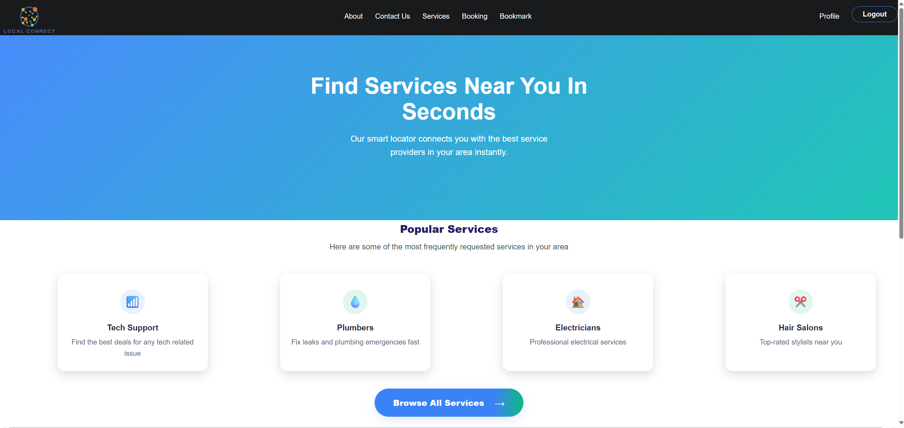
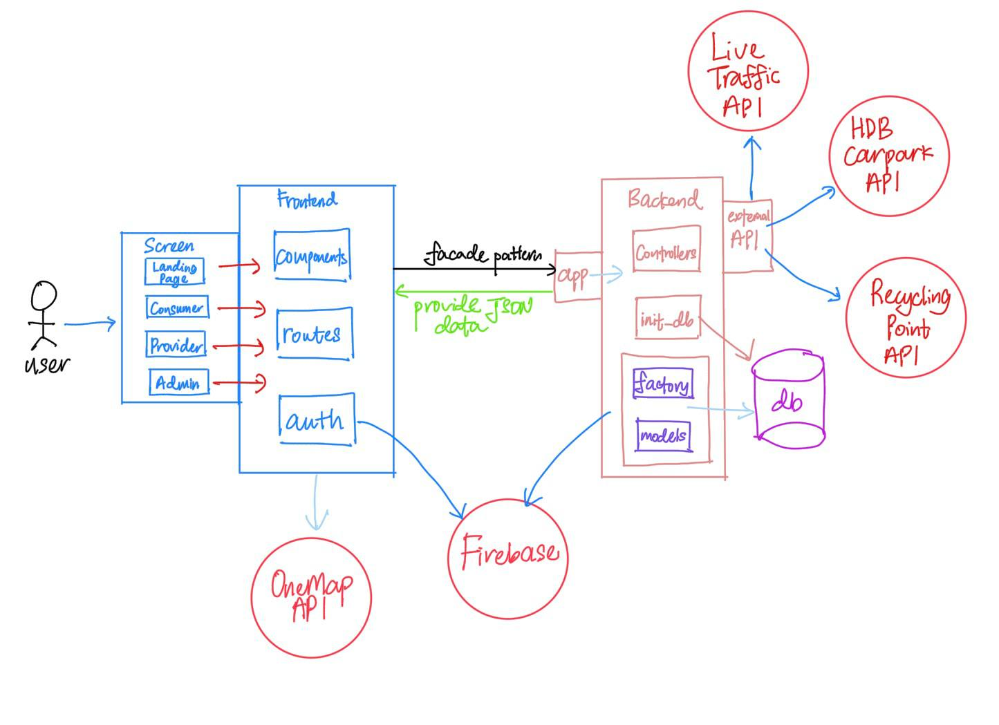

# LocalConnect


**Table of Contents**  
- [Problem Statement](#problem-statement)  
- [Our Solution](#our-solution)  
- [Challenges Faced](#challenges-faced)  
- [Key Features](#key-features)  
- [Tech Stack](#tech-stack)  
- [Software Engineering Practices](#software-engineering-practices)  
- [Installation & Setup](#installation--setup)  
- [API Documentation](#api-documentation)  
- [License](#license)

---

**Tagline:** In Singapore, there is a lack of dedicated platforms that connect freelancers and small businesses with nearby customers. What if finding nearby services was as easy as a tap?

**Problem Statement:**  
- Small local service providers are hard to discover.  
- Users want quick, trustworthy discovery of nearby freelancers.  
- Small businesses need affordable visibility.  

**Our Solution:**  
LocalConnect is a community-driven platform that helps users easily discover and connect with nearby freelancers and small businesses — such as tutors, home chefs, or mechanics — all within their neighborhood.

**Painpoints Solved:**  
- Limited visibility for small businesses to reach local customers.  
- Difficulty for users to find trusted nearby service providers.  

---

## Challenges Faced
- Limited experience in web development and frontend–backend integration.  
- Collaboration issues on GitHub (merge conflicts, inconsistent code).  
- Initial unorganized project structure, solved by adopting MVC architecture and Facade design patterns.  

---

## Key Features

**Consumer Features:**  
- Authentication: Login and Sign-up (Consumer & Provider roles)  
- Service Search & Filtering: Price, Ratings, Location  
- Service Detail View  
- Bookmarks: Add/Remove  
- Reviews & Ratings: Add/Remove  
- Live Map: View services and nearby amenities (carparks, recycling points, traffic images)  
- Bookings: View/Delete  
- WhatsApp Contact Button  

**Provider Features:**  
- Add/Edit/Delete Service Listings  
- View Business Analytics: Number of bookings, reviews, average ratings  

**Admin Features:**  
- Remove Users  
- Remove Fake Reviews  

**External APIs:**  
- **OneMap API:** Geolocation, mapping, and distance calculations  
- **Data.gov.sg API:** Real-time HDB carpark info, waste collection points, traffic images  
- **Firebase:** Secure user authentication and session management  

---

## Tech Stack

**Frontend:**  
- React.js  
- Vanilla CSS  

**Backend:**  
- Python Flask  
- MySQL (SQLite for development)  

---

## Software Engineering Practices
- API Documentation & detailed code comments  
- Detailed README  
- Agile Methods (SCRUM) with weekly sprints documented in Notion  
- Consistent code style using Prettier  
- Reusable components in React (e.g., Navbar, Booking Overlay, Review Section)  

---

## Installation & Setup

1. Clone the repository:
```bash
git clone https://github.com/your-username/localconnect.git
cd localconnect
```
2. Create a virtual environment and activate it:
```bash
python -m venv venv
# On macOS/Linux
source venv/bin/activate
# On Windows
venv\Scripts\activate
```

3. Install dependencies:
```bash
pip install -r requirements.txt
```
4. Setup Firebase Admin SDK:

Add your firebase_adminsdk.json to the backend directory.

Ensure Firebase is initialized in your Flask app.

5. Run the application:
```bash
flask run
```

6. Access the server:
Open your browser and go to: http://127.0.0.1:5000/

---

## API Documentation

You can access the API documentation when the Flask server is running:

1. Start the Flask server:
```bash
flask run
```
2. Open your browser and navigate to:
http://localhost:5000/api/docs#/

## License

This project is licensed under the MIT License. See the [LICENSE](LICENSE) file for details.
